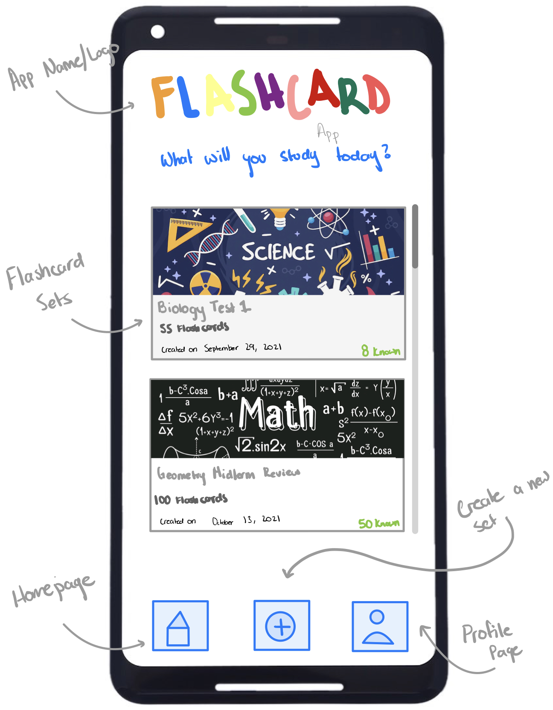

# Milestone 1 - Flash Card App

## Table of Contents

1. [Overview](#Overview)
1. [Product Spec](#Product-Spec)
1. [Wireframes](#Wireframes)

## Overview
This app will be used as a study tool for anyone to help advance their learning, by improving their long-term memory retention. The flash cards will be two-sided, with a promt on one side and information about the prompt on the other. This information could vary from names, vocabulary, concepts, procedures ect.

### Description

When opening the Flash Card App you will be able to create an account or log into your account to begin your studying. Once logged in the user can begin to create a list of cards with a prompt on one side and information about the prompt on the other. When the user is completed with making their flash cards they can begin studying them. There can be different sets of study material that has been made and can be selected on by the user. Once one is selected the user can read one side of the card and tap on the card to reveal the other side that has the answer. When the set of cards has been completed the user can either restart the set from the begining or go back to the home screen to choose other study material. 

### App Evaluation

- **Category**: Productivity/Education
- **Mobile**: Mobile is used to create, edit, and view flashcard decks. Camera can be used to take pictures to use in or as flashcards.
- **Story**: Creates a location to store study materials and review them later.
- **Market**: This app has a broad scope. It can be used by students specifically but it can also be used by any person who needs to study materials. ex. learning new language, parent teaching young child their alphabet, new employee learning job tools and requirements.
- **Habit**: Users are using this throughout their day to input data. They will also use it when wanting to review the material.
- **Scope**: V1 could allow users to input flashcard data. V2 could allow users to create multiple decks. V3 could allow users to add colors, images, pronunciation to flashcards.

## Product Spec

### 1. User Features (Required and Optional)

**Required Features**

* Log in or create a new user account
* Select option button to create new set of flash cards
* Input promt for one side of the card & information about the prompt on the other
* Save and name the group of flash cards that has just been created
* The name of those flash cards will now be available to begin studying
* Once selecting the desired set of flash cards the user will see the prompt first.
* Tapping on the card will flip the card to see the information about the prompt
* The user will select on the next button to view the next card and so on
* Completing the cycle of created cards will give you the option to restart the cards from the beginning
* There will be a home button to return to the main menu to view the list of created flash cards
* The user may edit their created flash sets to either add or remove cards in their sets.
* User may also have the option to delete an entire set of cards
* User can search for a created set of cards in their list

### 2. Screen Archetypes

- [Login screen]
  - User can log in

- [Register screen]
    - user can create an account

- [Home screen]
  - user can view set of created cards
  - user can swipe left to edit or delete card set
  - user can search for a set of cards in their list
  - user can select create option to create new flash set
  - log out
  
- [Create screen]
    - user can input prompt for one side of the card
    - information for that prompt can be inputed for the other side
    - select add new card and repeat the process
    - save set of cards that have been created
    - input a name for the list of cards
    - return home

- [Study screen]
    - read the prompt 
    - tap on the card to flip 
    - read information about the prompt
    - select next button to move on to next prompt
    - complete the set of created cards
    - restart button to start set of cards from the begining
    - return home button
    - edit cards button

- [Edit cards]
    - view information of all cards
    - edit information
    - delete cards
    - add cards
    - update/save cards to home

### 3. Navigation

**Tab Navigation** (Tab to Screen)

* Home feed
* Search Flash cards
* Create new set of cards
* Select set of cards

**Flow Navigation** (Screen to Screen)

- [Login Screen]
  - => Home
- [Registration screen]
  - => Home
- [Create Card Screen]
    - Home => Create Cards
- [Save Cards]
    - => Home
- [Update card]
    - home => update created card
- [Log Out]
    - home => login screen

## Wireframes

### Home Page

### Term View

### Definition View

### New Set Page

### Profile Page

### [BONUS] Digital Wireframes & Mockups

### [BONUS] Interactive Prototype

### User Stories

- [X] GitHub Project Board created
- [X] GitHub Milestones created
- [X] GitHub Issues created from user features
- [X] Issues added to project and assigned to specific team member
- [X] Updated status of issues in Project board
- [X] Sprint planned for next week -- Issues created, assigned & added to project board
- [X] Completed user stories checked-off in README
- [X] GIFs created to show build progress and added to README

### Sprint 1 Progress

Project Board Gif

